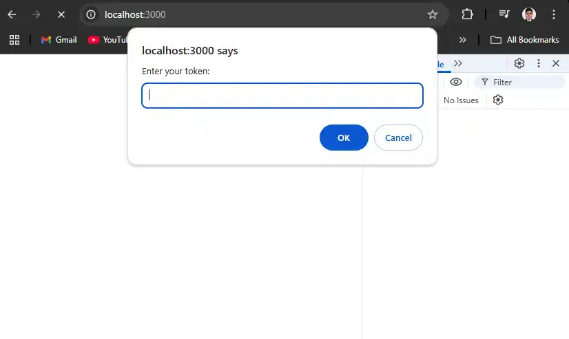
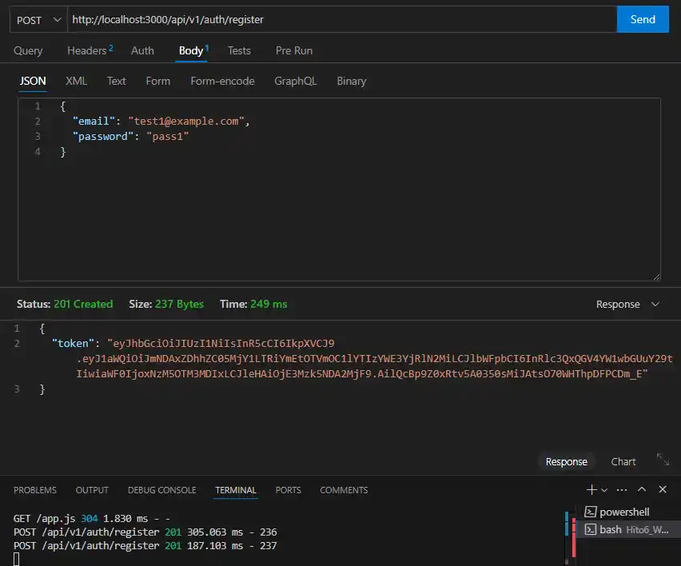
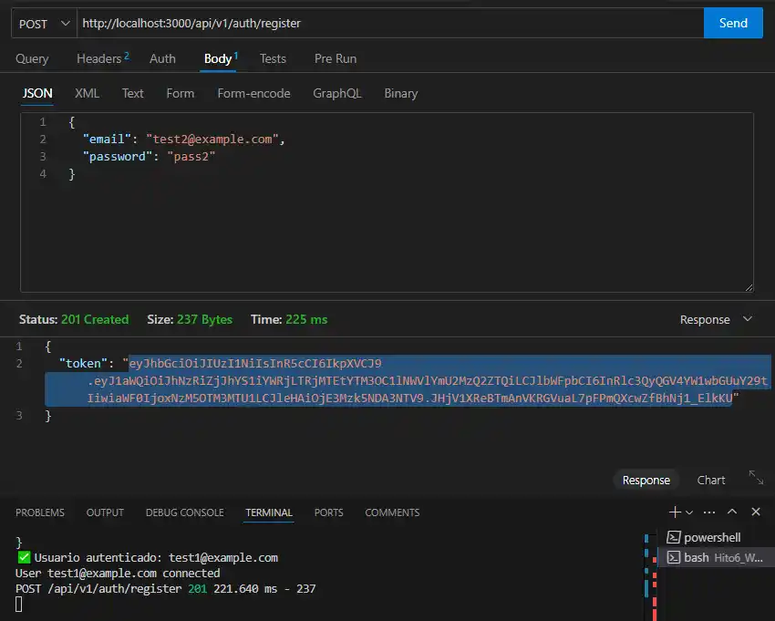
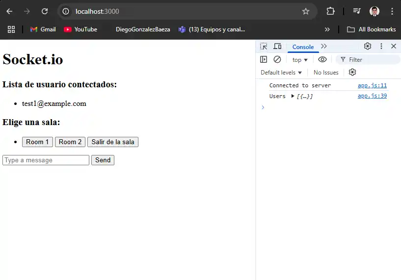
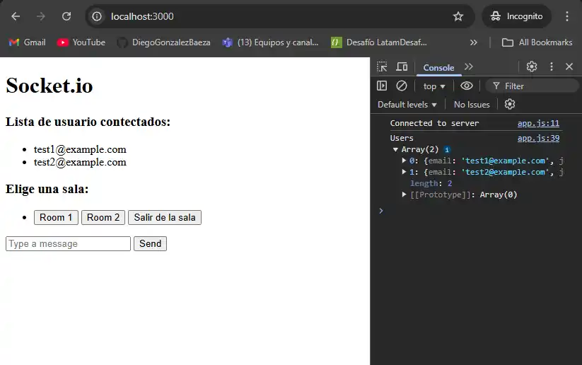
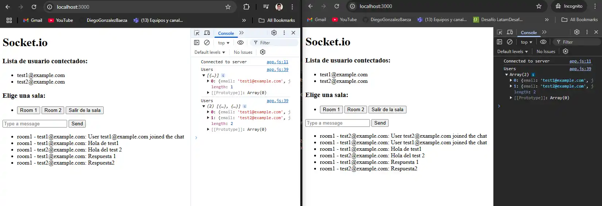

# Hito6_Websocket_Patrones_Integracion_Empresarial

Proyecto educativo básico "Creación de un servidor" con node, express y sequelize

API de Review y Rating de peliculas (IMDb y Rotten Tomatoes) 

ESTA ES LA CONTINUACIÓN DEL REPOSITORIO: https://github.com/DiegoGonzalezBaeza/Hito_Node.js_API_Sequelize

RECORDAR: que la aplicación de docker debe estar abierta.

### Comandos Docker

```bash
docker compose up -d # Inicia los contenedores en segundo plano
docker compose stop # Detiene los contenedores
docker compose down # Detiene y elimina los contenedores
dokcer compose logs db # Muestra los logs del contenedor db
```

# 1.- Instalar socket.io

```bash
npm install socket.io
```

# 2.- Instalar cookie-parse y morgan:

```bash
npm install cookie-parser
npm install morgan

npm i --save-dev @types/cookie-parser
npm i --save-dev @types/morgan
```

Morgan: middleware de express, que sirve para visualizar las peticiones, que se hacen en nuestro servidor.

# 3.- Creacion de interface de Message:

```ts
export interface Message {
    id: number;
    userId: string;
    username: string;
    content: string;
    timestamp: Date;
    room: string;
  };
```

# 4.- Middleware para autenticar usuarios

```ts
chat.use(async (socket, next) => {
  try {
    console.log("🔍 Authentication middleware executed");

    const token = socket.handshake.auth.token;
    console.log("📌 Token received:", token); // 👈 Log importante

    if (!token) {
      console.log("❌ No token received");
      return next(new Error("Authentication error"));
    }

    const secret = process.env.JWT_SECRET;
    if (!secret) {
      console.error("❌ JWT_SECRET is not defined in environment variables");
      return next(new Error("Server error"));
    }

    // Verify the token
    const decoded = jwt.verify(token, secret) as JwtPayload;
    console.log("✅ Token decoded:", decoded); // 👈 Log importante

    if (!decoded.email) {
      console.log("❌ Invalid token (missing email)");
      return next(new Error("Invalid token"));
    }

    // Find user in the database
    const user = await UserModel.findOne({ where: { email: decoded.email } });

    if (!user) {
      console.log("❌ User not found in the database");
      return next(new Error("User not found"));
    }

    console.log("✅ User authenticated:", user.email);
    socket.user = user; // Se asigna el usuario al socket
    next();
  } catch (error) {
    console.log("❌ WebSocket authentication error:", error);
    next(new Error("Authentication error"));
  }
});
```

# 3.- Chat:

```ts
chat.on("connection", (socket) => {
  const user = socket.user as User; // Recuperamos el usuario completo

  if (!user) {
    console.log("No user found in socket");
    return;
  }
  
  // Guardamos en `connectedUsers`
  connectedUsers[socket.id] = {
    id: user.id,
    email: user.email, // Ahora `email` viene del objeto `user`
    joinedAt: new Date(),
  };

  console.log(`User ${user.email} connected`);

  // Broadcast a todos los usuarios conectados
  chat.emit("users", Object.values(connectedUsers));

  // Evento para unirse a una sala
  socket.on("joinRoom", (room) => {
    socket.join(room);

    const messageData = {
      id: Date.now(),
      userId: user.id,
      username: user.email,
      content: `User ${user.email} joined the chat`,
      timestamp: new Date(),
      room: room,
    };

    chat.to(room).emit("message", messageData);
  });

  // Enviar mensaje solo a la sala
  socket.on("sendMessage", ({ room, message }) => {
    const messageData = {
      id: Date.now(),
      userId: user.id,
      username: user.email,
      content: message,
      timestamp: new Date(),
      room: room,
    };

    messages.push(messageData);
    chat.to(room).emit("message", messageData);
  });

  // Dejar la sala
  socket.on("leaveRoom", (room) => {
    socket.leave(room);
    console.log(`User ${user.email} left room: ${room}`);
  });

  // Desconectar usuario
  socket.on("disconnect", () => {
    delete connectedUsers[socket.id];
    console.log(`User ${user.email} disconnected`);

    // Broadcast a todos los usuarios conectados
    chat.emit("users", Object.values(connectedUsers));
  });
});
```

# 4.- Ingreso de datos: 

## - Users
```json
{
  "email": "user@example.com",
  "password": "string"
}
```

## - Promt


## - Register Token Usuario 1


## - Register Token Usuario 2


## - WEB User 1


## - WEB User 2


## - Chat
